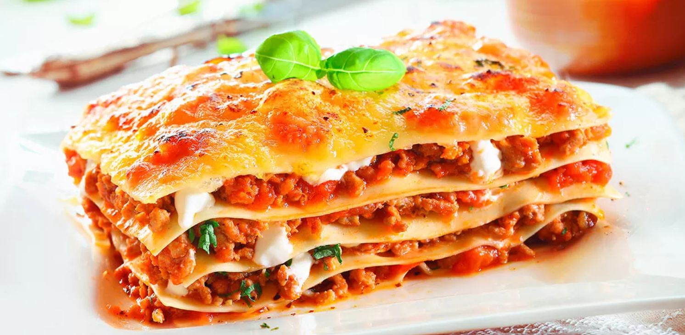

# Presentacion

Etapa 1 - Reconocimiento del entorno y armado de equipos con SCV

**Tatiana Lorena Hernández González**

**Rol en la industria:** Diseñadora

**Ubicación:** Bogotá D.C.

**Perfil:** Diseñadora UI/UX con conocimientos en modelado 3D y texturizado, especializada en los programas de Blender y Figma.

**Plato favorito:** Hamburguesa

=======

**Jimmy Guzmán**

**Rol en la industria:** Artista Técnico (Technical Artist)

**Ubicación:** Bogotá D.C.

**Perfil:** Estudiante de Ingeniería Multimedia enfocado en el desarrollo de animaciones, efectos visuales (VFX) e integración de herramientas de IA generativa, con conocimientos en gestión de infraestructura técnica.

**Plato favorito:** Hamburguesa

=======
**FREDDY ALBERTO MOYANO ROJAS**

**Rol en la industria:** REVISOR

**Ubicación:** BOGOTÁ D.C.

**Perfil:** Estudiante de Ingeniería Multimedia, diseñador y fotógrafo apasionado por la creación audiovisual y multimedia..

**Plato favorito:** Perro Caliente

=======
**Grupo 213027_3**

# Etapa1-CarolinaCortes
## Carolina Cortes Rodriguez

**Rol:** Programadora de videojuegos  
**Ubicación:** Colombia  

**Perfil:**  
Soy estudiante interesada en el desarrollo de videojuegos, con interés en la programación y el uso de motores como Unity.

### Mi plato favorito

